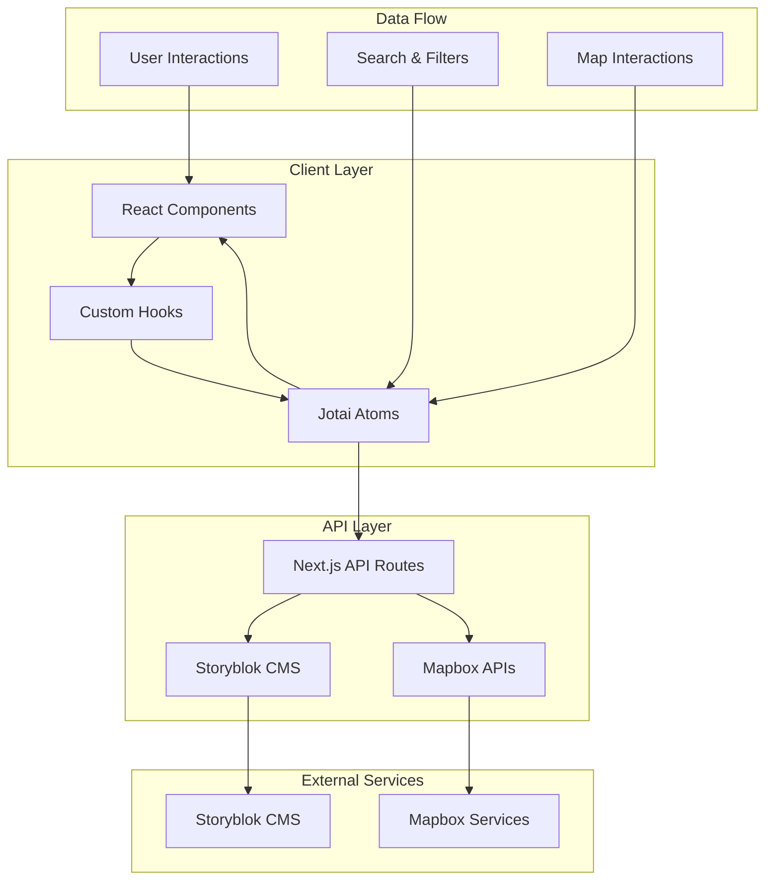

# Sydney Sports Facility Explorer

A responsive web application for exploring sports facilities in Sydney, integrating location search, map view, and dynamic content from a Headless CMS.

## Architecture Overview

This project is built with a senior-level architecture focusing on:

- Next.js 15 App Router with TypeScript for type safety
- Jotai for atomic state management
- Tailwind CSS for responsive design
- Storyblok CMS for content management
- Mapbox GL JS for interactive maps
- GSAP for smooth animations

## Quick Start

### Prerequisites

- Node.js 18+ 
- npm or yarn
- Storyblok account
- Mapbox account

### 1. Install Dependencies

```bash
npm install
```

### 2. Environment Setup

Copy the environment template and configure your API keys:

```bash
cp env.example .env.local
```

Update `.env.local` with your credentials:

```env
# Storyblok CMS Configuration
NEXT_PUBLIC_STORYBLOK_ACCESS_TOKEN=your_preview_token_here
STORYBLOK_ACCESS_TOKEN=your_public_token_here

# Mapbox Configuration  
NEXT_PUBLIC_MAPBOX_ACCESS_TOKEN=your_mapbox_token_here
```

### 3. Storyblok Setup

1. Create a new Storyblok space
2. Create an `Experience` content type with these fields:
   - `title` (Text)
   - `description` (Textarea)
   - `image` (Asset)
   - `tags` (Multi-option)
   - `externalLink` (Link)
   - `locationTag` (Text)
   - `coordinates` (Custom field with lat/lng)
   - `amenities` (Multi-option)
   - `hours` (Custom field)
   - `contact` (Custom field)
   - `pricing` (Custom field)
   - `accessibility` (Multi-option)

3. Add some sample experiences
4. Get your access tokens from Space Settings > Access Tokens

### 4. Mapbox Setup

1. Create a Mapbox account at [mapbox.com](https://mapbox.com)
2. Generate an access token from your account dashboard
3. Add the token to your `.env.local` file

### 5. Run Development Server

```bash
npm run dev
```

Visit [http://localhost:3000](http://localhost:3000) to see the application.

## Project Structure

```
src/
├── app/                    # Next.js 15 App Router
│   ├── (explore)/         # Route group for explore pages
│   │   └── explore/       # Main explore page
│   ├── api/              # API routes
│   │   └── experiences/  # Experience API endpoints
│   ├── globals.css        # Global styles
│   ├── layout.tsx         # Root layout
│   ├── page.tsx           # Home page (redirects to /explore)
│   └── not-found.tsx      # 404 page
├── components/            # React components (presentation only)
│   ├── experiences/       # Experience-related components
│   ├── map/              # Map components
│   ├── search/           # Search components
│   └── ui/               # Reusable UI components
├── hooks/                # Custom business logic hooks
│   ├── useExperiences.ts      # Data fetching and transformation
│   ├── useLocationSearch.ts   # Location search and autocomplete
│   ├── useFacilityFilter.ts   # Facility type filtering
│   ├── useMapbox.ts           # Map initialization and events
│   ├── useMapMarkers.ts       # Map marker management
│   ├── useGsapAnimation.ts    # Animation logic
│   └── useExperienceSelection.ts # Experience selection logic
├── lib/                  # Utility libraries
│   ├── jotai/           # State management atoms
│   ├── mapbox/          # Mapbox API client
│   ├── storyblok/       # Storyblok CMS client
│   └── utils.ts         # Common utilities
└── types/               # TypeScript type definitions
    ├── storyblok.ts     # CMS types
    ├── mapbox.d.ts      # Mapbox types
    └── gsap.d.ts        # GSAP types
```

## Key Features

### Custom Hooks Architecture
- Business Logic Separation: All business logic extracted into reusable custom hooks
- DRY Principle: Eliminated code duplication between components
- Testable Logic: Hooks can be tested independently of UI components
- Composable Patterns: Hooks can be combined and reused across components

### Location Search & Map Synchronization
- Mapbox Places API integration for address autocomplete
- Real-time map synchronization with search results
- Geographic filtering based on map bounds
- Proximity-based search with radius controls

### Content Management
- Storyblok CMS integration for dynamic content
- Type-safe content fetching with TypeScript
- Structured content models for experiences
- Image optimization and responsive assets

### State Management
- Jotai atoms for fine-grained reactivity
- Atomic state updates prevent unnecessary re-renders
- Centralized state logic with clear separation of concerns
- Optimistic updates for better UX

### User Experience
- GSAP animations for smooth transitions
- Responsive design with mobile-first approach
- Loading states and skeleton screens
- Error handling with graceful fallbacks
- Accessibility considerations throughout

## Custom Hooks Documentation

### Data Management Hooks

#### `useExperiences`
Handles all data fetching logic for experiences with fallback strategies.

```typescript
const { experiences, isLoading, error, isDraftMode, refetch } = useExperiences({ 
  isDraft: false 
});
```

Features:
- API calls to `/api/experiences` and `/api/experiences/draft`
- Automatic fallback to sample data
- Loading and error state management
- Draft mode detection

#### `useLocationSearch`
Manages location search with debounced API calls and suggestion handling.

```typescript
const {
  searchQuery,
  suggestions,
  isSearching,
  handleSearchChange,
  handleLocationSelect
} = useLocationSearch();
```

Features:
- Debounced search with Mapbox Places API
- Suggestion management and display
- Location selection with coordinate updates
- Search state management

#### `useFacilityFilter`
Handles facility type filtering with predefined options.

```typescript
const { facilityType, setFacilityType, facilityTypes } = useFacilityFilter();
```

Features:
- Filter state management
- Predefined facility type options
- Type-safe filter operations

### Map & Interaction Hooks

#### `useMapbox`
Manages map initialization, events, and cleanup.

```typescript
const { mapContainer, isMapLoaded, map } = useMapbox();
```

Features:
- Map initialization with proper token handling
- Event handlers for move, zoom, and interaction states
- Bounds updates for filtering
- Automatic cleanup on unmount

#### `useMapMarkers`
Handles marker creation, updates, and interaction.

```typescript
useMapMarkers({ map: map.current, isMapLoaded });
```

Features:
- Dynamic marker creation based on experiences
- Marker click handling for selection
- Visual styling based on selection state
- Automatic cleanup of old markers

### Animation & UI Hooks

#### `useGsapAnimation`
Manages GSAP animations for smooth transitions.

```typescript
useGsapAnimation({ 
  items: filteredExperiences, 
  containerRef,
  animationClass: '.experience-card'
});
```

Features:
- Staggered entrance animations
- Configurable animation classes
- Automatic re-animation on data changes

#### `useExperienceSelection`
Handles experience selection and auto-scrolling.

```typescript
const { selectedExperience, setSelectedExperience } = useExperienceSelection({ 
  containerRef 
});
```

Features:
- Selection state management
- Auto-scroll to selected experience
- Smooth scrolling behavior

## Hook Composition Patterns

### Basic Component Pattern
```typescript
export function ExperienceList() {
  const [filteredExperiences] = useAtom(filteredExperiencesAtom);
  const containerRef = useRef<HTMLDivElement>(null);
  
  const { isLoading, error } = useExperiences();
  const { selectedExperience, setSelectedExperience } = useExperienceSelection({ containerRef });
  
  useGsapAnimation({ items: filteredExperiences, containerRef });
  
  // Component renders UI only
}
```

### Advanced Composition
```typescript
export function MapView() {
  const [experiences] = useAtom(filteredExperiencesAtom);
  
  const { mapContainer, isMapLoaded, map } = useMapbox();
  
  useMapMarkers({ map: map.current, isMapLoaded });
  
  // Map renders with all business logic handled by hooks
}
```

## Development

### Code Quality
- TypeScript strict mode for type safety
- ESLint configuration for code quality
- Tailwind CSS for consistent styling
- Component composition for reusability

### Performance
- Next.js 15 with App Router for optimal performance
- Image optimization with Next.js Image component
- Code splitting with dynamic imports
- Lazy loading for map and heavy components

### Testing Strategy
- Component testing with React Testing Library
- Integration testing for API interactions
- E2E testing for critical user flows
- Performance testing with Lighthouse

## Deployment

### Vercel (Recommended)
1. Connect your GitHub repository to Vercel
2. Add environment variables in Vercel dashboard
3. Deploy automatically on push to main branch

### Other Platforms
- Netlify: Compatible with Next.js static export
- AWS: Use Vercel or custom server setup
- Docker: Use Next.js Dockerfile for containerization

## API Documentation

### Storyblok API
- Endpoint: `https://api.storyblok.com/v2/cdn/stories`
- Authentication: Access token in headers
- Content Type: `experience`
- Filtering: By tags, location, and custom fields

### Mapbox API
- Places API: For location search and autocomplete
- Geocoding API: For reverse geocoding
- Map Styles: Streets, satellite, and custom styles

## Contributing

1. Fork the repository
2. Create a feature branch
3. Make your changes with proper TypeScript types
4. Add tests for new functionality
5. Submit a pull request

## License

This project is licensed under the MIT License - see the LICENSE file for details.

## Architecture Overview

### Architecture Diagram



### Core Architecture Principles

#### 1. Separation of Concerns
- Components: Pure presentation logic only
- Hooks: Business logic and state management
- Atoms: Centralized state with fine-grained reactivity
- API Routes: Data fetching and external service integration

#### 2. Custom Hooks Pattern
All business logic is extracted into reusable custom hooks:

```typescript
export function useLocationSearch() {
  // Handles search state, API calls, debouncing
  // Returns clean interface for components
}
```

Benefits:
- Testable business logic
- Reusable across components
- Clear separation of concerns
- Easy to mock for testing

#### 3. Atomic State Management
Using Jotai for fine-grained reactivity:

```typescript
export const filteredExperiencesAtom = atom<Experience[]>((get) => {
  // Derived state that automatically updates when dependencies change
});
```

### Data Flow Architecture

#### 1. User Interaction Flow
```
User Action → Component → Hook → Atom → API → External Service
```

#### 2. State Management Flow
```
User Input → Hook → Atom Update → Derived State → Component Re-render
```

#### 3. Data Fetching Flow
```
Component Mount → Hook → API Route → External Service → State Update → UI Update
```

### Component Architecture

#### Component Hierarchy
```
App
├── Layout
├── Explore Page
│   ├── SearchInterface
│   ├── ExperienceList
│   └── MapView
└── Experience Detail Page
    ├── Hero Section
    ├── Content Sections
    └── Map Integration
```

#### Custom Hooks Architecture
```
useLocationSearch     → Location search and autocomplete
useGeolocation        → Browser geolocation API
useAdvancedFilters    → Multi-tag and filter management
useExperiences        → Data fetching and caching
useMapbox            → Map initialization and events
useMapMarkers        → Marker management
useGsapAnimation     → Animation orchestration
```

### State Management Strategy

#### Jotai Atoms Structure
```typescript
// Location & Coordinates
selectedLocationAtom
coordinatesAtom
mapBoundsAtom

// Search & Filtering
searchQueryAtom
facilityTypeFilterAtom
selectedTagsAtom
priceFilterAtom
accessibilityFilterAtom

// Experience Data
experiencesAtom
filteredExperiencesAtom

// UI State
isLoadingAtom
errorAtom
selectedExperienceAtom
```

#### Derived State Pattern
```typescript
export const filteredExperiencesAtom = atom<Experience[]>((get) => {
  const experiences = get(experiencesAtom);
  const searchQuery = get(searchQueryAtom);
  // ... filtering logic
  return filteredExperiences;
});
```

### API Integration Patterns

#### 1. Storyblok CMS Integration
```typescript
export async function fetchExperiences(params: ExperienceSearchParams) {
  try {
    const response = await storyblokClient.get('cdn/stories', params);
    return transformResponse(response);
  } catch (error) {
    return getSampleData();
  }
}
```

#### 2. Mapbox Integration
```typescript
const debouncedSearch = debounceAsync(async (query: string) => {
  const places = await searchPlaces(query, options);
  setSuggestions(places);
}, 300);
```

### Error Handling Strategy

#### 1. Graceful Degradation
```typescript
try {
  const data = await fetchFromAPI();
  return data;
} catch (error) {
  return getFallbackData();
}
```

#### 2. User-Friendly Messages
```typescript
switch (error.code) {
  case 1: return 'Location access denied. Please enable permissions.';
  case 2: return 'Location unavailable. Check GPS settings.';
  case 3: return 'Location request timed out. Please try again.';
}
```

#### 3. Loading States
- Skeleton screens for better UX
- Progressive loading
- Optimistic updates

### Mobile Considerations

#### 1. Responsive Design
- Mobile-first approach
- Touch-friendly interactions
- Optimized map controls

#### 2. Performance
- Lazy loading for mobile
- Reduced animation complexity
- Optimized bundle size

#### 3. Accessibility
- Screen reader support
- Keyboard navigation
- High contrast support

### Future Enhancements

#### 1. Performance
- Service worker for offline support
- Image optimization
- Bundle splitting

#### 2. Features
- Real-time updates
- Push notifications
- Advanced analytics

#### 3. Scalability
- Microservices architecture
- CDN integration
- Database optimization

## Architecture & Trade-offs

### Key Architectural Decisions

#### State Management: Jotai over Redux
Why Jotai?
- Atomic updates: Fine-grained reactivity prevents unnecessary re-renders
- TypeScript integration: Excellent type safety with minimal boilerplate
- Performance: Only components using specific atoms re-render
- Simplicity: Less setup and configuration than Redux

Trade-offs:
- Smaller ecosystem compared to Redux
- Team learning curve for atomic patterns
- Less third-party tooling support

#### Styling: Tailwind CSS over Styled Components
Why Tailwind?
- Development speed: Rapid prototyping and consistent design
- Performance: Smaller bundle size through purging
- Dark mode: Built-in support with minimal configuration
- Maintainability: Utility-first approach reduces CSS complexity

Trade-offs:
- Initial learning curve for utility classes
- Less component encapsulation
- Potential for class name conflicts

#### Animation: GSAP over Framer Motion
Why GSAP?
- Performance: Hardware-accelerated animations
- Control: Precise timeline management and sequencing
- Features: Professional animation capabilities
- Bundle size: Optimized for production

Trade-offs:
- Steeper learning curve
- Less React-specific integration
- Manual cleanup required

### Performance Optimizations

#### Code Splitting Strategy
```typescript
// Dynamic imports for heavy components
const MapView = dynamic(() => import('@/components/map/MapView'), {
  loading: () => <MapLoadingSkeleton />
});
```

#### Animation Performance
- GSAP ScrollTrigger: Optimized for 60fps animations
- Reduced motion support: Respects user preferences
- Mobile optimization: Simplified animations on smaller screens

#### State Management Performance
- Atomic updates: Only affected components re-render
- Derived state: Computed values cached automatically
- Optimistic updates: Immediate UI feedback

### Mobile Performance Considerations

#### Bundle Optimization
- Code splitting: Route-based and component-based
- Tree shaking: Unused code elimination
- Image optimization: Next.js Image component with WebP support

#### Animation Degradation
```typescript
const prefersReducedMotion = window.matchMedia('(prefers-reduced-motion: reduce)');
if (prefersReducedMotion.matches) {
  // Use simpler animations or disable
}
```

### Scalability Patterns

#### Component Architecture
- Atomic design: Reusable, composable components
- Hook composition: Business logic separation
- Prop interfaces: Consistent, typed component APIs

#### State Scalability
- Atomic state: Granular updates prevent cascade re-renders
- Derived state: Computed values update automatically
- Error boundaries: Isolated failure handling

## Testing Strategy

### Test Coverage
- Unit tests: Custom hooks and utility functions
- Component tests: User interactions and rendering
- Integration tests: API routes and data flow
- E2E tests: Critical user journeys

### Testing Tools
- Vitest: Fast, modern test runner
- Testing Library: User-centric component testing
- MSW: API mocking for integration tests

### Test Examples
```typescript
// Hook testing
describe('useGeolocation', () => {
  it('should handle permission denied gracefully', async () => {
    // Test implementation
  });
});

// Component testing
describe('ThemeToggle', () => {
  it('should cycle through themes on click', () => {
    // Test implementation
  });
});
```

## Performance Metrics

### Core Web Vitals
- LCP: < 2.5s (Largest Contentful Paint)
- FID: < 100ms (First Input Delay)
- CLS: < 0.1 (Cumulative Layout Shift)

### Optimization Techniques
- Image optimization: WebP format with fallbacks
- Code splitting: Route and component level
- Caching: API responses and static assets
- Bundle analysis: Regular size monitoring

## Development Workflow

### Code Quality
- TypeScript strict mode: Compile-time error checking
- ESLint configuration: Consistent code style
- Pre-commit hooks: Automated quality checks
- Code reviews: Peer review process

### Testing Workflow
```bash
# Run all tests
npm run test

# Run tests with coverage
npm run test:coverage

# Run tests in watch mode
npm run test:watch
```

## Analytics & Monitoring

### Performance Monitoring
- Core Web Vitals: Real user metrics
- Bundle analysis: Size tracking
- Error tracking: User experience monitoring

### User Analytics
- Search patterns: Popular locations and filters
- Map interactions: Zoom and pan behavior
- Feature usage: Most used functionality

## Security Considerations

### API Security
- Environment variables: Secure key management
- Rate limiting: API abuse prevention
- Input validation: XSS and injection protection

### Data Privacy
- Geolocation: User consent and data handling
- Analytics: Privacy-compliant tracking
- Cookies: Minimal usage with clear policies

## Browser Support

### Supported Browsers
- Chrome: 90+
- Firefox: 88+
- Safari: 14+
- Edge: 90+

### Progressive Enhancement
- Core functionality: Works without JavaScript
- Enhanced features: JavaScript-dependent features
- Fallbacks: Graceful degradation for older browsers

## AI Assistance Disclosure

This project was developed with AI assistance for:
- Code generation: Component and hook implementation
- Architecture patterns: State management and data flow
- Documentation: Technical writing and examples
- Testing: Test case generation and optimization
- Performance: Optimization recommendations

AI Tools Used:
- GitHub Copilot for code completion
- ChatGPT for architecture guidance
- Claude for documentation review
- Custom AI assistants for testing

Human Oversight:
- All AI-generated code was reviewed and validated
- Architectural decisions were made by the development team
- Code quality standards were maintained throughout
- Security considerations were human-verified

## Support

For questions or issues:
1. Check the documentation
2. Search existing issues
3. Create a new issue with detailed information
4. Contact the development team

## License

This project is licensed under the MIT License - see the LICENSE file for details.

---

Built with love for Sydney's sports community

Architecture decisions, trade-offs, and performance optimizations documented for future development and team onboarding.
